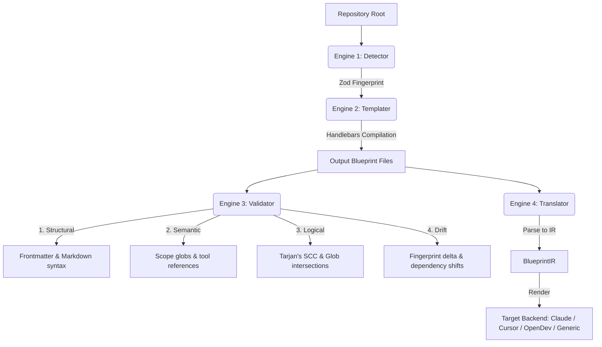

# open-blueprint (`bp`)

[](https://www.npmjs.com/package/@agentic/bp)
[](LICENSE)
[](https://github.com/0xkhdr/open-blueprint/actions)
[](coverage)
[](https://bun.sh)
[](src/lsp)

**open-blueprint (`bp`)** is a zero-runtime-overhead development and CI command-line utility that prepares software repositories for agentic AI tools (such as Claude Code, Cursor, OpenDev, and Goose) by scaffolding standardized governance structures, verifying their integrity, and actively detecting configuration drift.

```
                  ┌──────────────────────────────┐
                  │            bp CLI            │
                  └──────────────┬───────────────┘
                                 │
         ┌───────────────────────┼───────────────────────┐
         ▼                       ▼                       ▼
 ┌──────────────┐        ┌──────────────┐        ┌──────────────┐
 │   DETECTOR   │        │  TEMPLATER   │        │  VALIDATOR   │
 │  (Repo MRI)  ├───────►│ (Handlebars) ├───────►│ (4-Layer QA) │
 └──────────────┘        └──────────────┘        └──────────────┘
                                                         │
                                                         ▼
                                                 ┌──────────────┐
                                                 │  TRANSLATOR  │
                                                 │(Backend Sync)│
                                                 └──────────────┘
```

---

## 📖 Table of Contents
1. [Core Philosophy](#-core-philosophy)
2. [The 5 Blueprint Layers](#-the-5-blueprint-layers)
3. [System Architecture (The 4 Engines)](#-system-architecture-the-4-engines)
   - [Detector Engine](#1-detector-engine)
   - [Templater Engine](#2-templater-engine)
   - [Validator Engine](#3-validator-engine)
   - [Translator Engine](#4-translator-engine)
4. [CLI Command Reference](#-cli-command-reference)
5. [CLI Exit Codes](#-cli-exit-codes)
6. [Practical Recipes & Use Cases](#-practical-recipes--use-cases)
7. [Configuration System](#-configuration-system)
8. [Plugin / Extension API](#-plugin--extension-api)
9. [Developer Guide](#-developer-guide)
10. [License](#-license)

---

## 🎯 Core Philosophy

Agentic AI tools operate best when given clear, non-contradictory boundaries, structured roles, and explicit descriptions of a repository's topology and style. However, managing these configurations across multiple repositories manually leads to duplication, rule conflict, and drift.

`bp` solves this by introducing a **development-time and CI-time only** governance system:
- **Scaffolding-Only**: Generates native configuration files already consumed by agentic tools (e.g., `CLAUDE.md`, `.cursorrules`). Once initialized, the `bp` tool can be fully uninstalled; the files continue to govern the agents.
- **Idempotency via Block-Level Merging**: Preserves custom developer edits using marker tags. Subsequent runs updates generated blocks while leaving manual notes intact.
- **Fail-Loud Diagnostics**: Structural, semantic, logical, or drift validation errors are emitted with line-precise pointers and actionable resolutions.
- **Backend Translation**: Standardizes configuration via a backend-agnostic Intermediate Representation (IR), allowing seamless compilation from one format (e.g. Claude Code) to another (e.g. Cursor).

---

## 🗂️ The 5 Blueprint Layers

`bp` structures repository governance into five discrete, logical layers:

| Layer | Name | Target File Pattern (Claude) | Core Purpose |
| :--- | :--- | :--- | :--- |
| **1** | **Spatial Anchor** | `CLAUDE.md` / `.claude/CLAUDE.md` | Contextualizes where the agent is in the project lifecycle, outlining commands and topology. |
| **2** | **Personas / Agents** | `.claude/agents/*.md` | Defines agent capabilities, permitted tools, and reasoning styles (e.g. Planner, Implementer, Reviewer). |
| **3** | **Rules** | `.claude/rules/*.md` | Establishes hard and soft constraints on the filesystem (e.g., security guidelines, styling patterns). |
| **4** | **Skills** | `.claude/skills/*.md` | Provides reusable step-by-step procedures to accomplish tasks (e.g. adding tests, refactoring async). |
| **5** | **Hooks** | `.claude/hooks/*` | Orchestrates lifecycle callback scripts run at tool boundaries (e.g., `pre_tool_use.js`). |

---

## 🏗️ System Architecture (The 4 Engines)



### 1. Detector Engine
The **Detector** performs static analysis of the repository. It makes **zero network calls, zero build-tool invocations, and runs zero shell commands**, completing in milliseconds.
* **Lockfile Parsing**: Detects package managers, linters, formatters, and bundlers via lockfile inspections (`package-lock.json`, `go.mod`, `Cargo.toml`, `poetry.lock`, `requirements.txt`).
* **Language & Framework Confidence scoring**: Inspects directory topology and project files to compute primary languages and frameworks.
* **Output**: A Zod-validated `Fingerprint` object:

```json
{
  "version": "1.0",
  "detected_at": "2026-05-28T02:34:11Z",
  "project": {
    "name": "my-express-service",
    "root": "/var/www/html/my-service",
    "type": "application",
    "git_workflow": "trunk-based"
  },
  "languages": [
    { "name": "typescript", "confidence": 1.0, "primary": true },
    { "name": "javascript", "confidence": 0.8, "primary": false }
  ],
  "frameworks": [
    { "name": "express", "confidence": 1.0 }
  ],
  "entry_points": [
    { "path": "src/index.ts", "type": "server" }
  ],
  "tooling": {
    "package_manager": "npm",
    "test_runner": "vitest",
    "test_command": "npm run test",
    "build_tool": "vite",
    "linter": "biome",
    "formatter": "biome",
    "ci_system": "github-actions"
  },
  "directory_topology": {
    "src_dirs": ["src"],
    "test_dirs": ["tests"],
    "config_dirs": ["."],
    "package_dirs": []
  },
  "security_signals": {
    "has_auth": true,
    "has_external_apis": false,
    "has_secrets_manager": true,
    "has_docker": true
  }
}
```

---

### 2. Templater Engine
The **Templater** maps the detected `Fingerprint` to template packs utilizing highly secure, logic-less **Handlebars** templates.
* **Template Fallback Chain**:
  `Fingerprint → [Language + Framework] → Language Base → Generic Fallback`
* **Block-Level Merging (Idempotency)**: To ensure developer modifications are preserved, `bp` parses files into generated blocks and preserve blocks:

```markdown
<!-- bp-generated:begin position -->
# Position: My Application
- Primary Language: TypeScript (Express)
- Entrypoint: src/index.ts
<!-- bp-generated:end position -->

<!-- bp:preserve -->
# Custom Team Conventions
- Always suffix controllers with 'Controller'.
- Internal billing microservices must log transaction UUIDs.
<!-- bp:end-preserve -->
```

On subsequent runs of `bp init`, the generated block is safely overwritten, while the `bp:preserve` blocks are retained exactly as-is.

---

### 3. Validator Engine
The **Validator** passes blueprints through a 4-layer validation pipeline. A failure in an early layer halts execution for that specific file but allows others to proceed.

```
[Blueprint Files] ──► Structural ──► Semantic ──► Logical ──► Drift ──► [Green CI / Clean Local]
```

1. **Structural Layer**: Validates YAML frontmatter formatting, file size thresholds, markdown structural hierarchy (unclosed code fences, broken header structures), and UTF-8 encoding.
2. **Semantic Layer**: Resolves rule scope globs against the actual filesystem (warning on zero-match scopes), verifies that `tools_required` exist in the target agent's allowlist, and guarantees that skills referenced by rules exist.
3. **Logical Layer**:
   * **Circular Skill Dependencies**: Performs a topological sort using **Tarjan's strongly connected components algorithm (`O(V+E)`)** to block circular skill imports.
   * **Rule Scope Overlap & Contradictions**: Evaluates scope overlaps. If two `hard` severity rules cover matching files (e.g. `src/services/**` vs `src/services/legacy/**`) and issue conflicting actions, a critical overlap error is thrown.
   * **Precedence Checking**: Validates that all rules are accounted for in the meta-rule precedence declarations.
4. **Drift Layer**: Compares current repository topology against `.bp-fingerprint.json` to detect unmapped dependencies, modified entry points, altered test commands, or untracked directories lacking rule coverage.

---

### 4. Translator Engine
The **Translator** converts blueprints between different agent targets by parsing raw documents into a unified, Zod-validated intermediate schema (`BlueprintIR`), and rendering the IR through target-specific adapters.

```
Source Files (.claude/) ──► IR Parser ──► BlueprintIR ──► IR Renderer ──► Target Files (.cursorrules)
```

Fidelity remains above **98%** in round-trip translations (e.g. `claude` ➔ `cursor` ➔ `claude`).

---

## 💻 CLI Command Reference

### `bp init [tool]`
Scaffolds a blueprint for the current repository.
* **Arguments**:
  * `tool`: The target agent backend (`claude`, `cursor`, `opendev`, `generic`).
* **Options**:
  * `--tool <backend>`: Backend type (positional override).
  * `--template <name>`: Force the use of a specific template pack.
  * `--force`: Overwrite existing files (while keeping `bp:preserve` blocks intact).
  * `--dry-run`: Output a unified diff of proposed changes instead of writing.
  * `--no-verify`: Do not run post-init validation checks.
* **Example**:
  ```bash
  bp init claude --dry-run
  ```

### `bp verify [paths...]`
Validates blueprint integrity.
* **Arguments**:
  * `paths`: One or more paths to verify (defaults to current directory).
* **Options**:
  * `--level <level>`: Level of validation (`structural`, `semantic`, `logical`, `drift`, `all`). Defaults to `all`.
  * `--json`: Print machine-readable JSON output for CI runners.
  * `--fix`: Attempt to auto-correct safe structural anomalies.
  * `--watch`: Start a watcher that re-validates on file changes (debounced at 300ms).
  * `--fail-on <level>`: Trigger non-zero exit code only at or above this severity. Defaults to `logical`.
* **Example**:
  ```bash
  bp verify --level logical --watch
  ```

### `bp sync`
Checks for repository drift and resolves differences interactively.
* **Options**:
  * `--auto-apply`: Automatically apply safe structural/drift fixes.
  * `--report`: Print the drift report only and exit.
  * `--json`: Emit the drift report as machine-readable JSON.
* **Example**:
  ```bash
  bp sync --report
  ```

### `bp convert`
Translates blueprint governance configurations between backends.
* **Options**:
  * `--from <backend>`: Source backend (`claude`, `cursor`, `generic`).
  * `--to <backend>`: Target backend (`claude`, `cursor`, `generic`).
  * `--input <path>`: Source directory containing blueprints (defaults to `.`).
  * `--output <path>`: Target directory for translated outputs.
* **Example**:
  ```bash
  bp convert --from claude --to cursor --output ./translated-rules
  ```

### `bp template`
Manages blueprint template packs.
* **Subcommands**:
  * `list`: List all official and locally installed template packs.
  * `install <pkg>`: Download, verify cryptographic signatures, and install a package (e.g., `@bp-templates/fastapi`).
  * `publish <path>`: Packages, cryptographically signs, and uploads a template pack to the registry.
* **Example**:
  ```bash
  bp template install @bp-templates/rust-axum
  ```

### `bp doctor`
Executes full diagnostics to troubleshoot why an agent may be ignoring configurations.
* **Options**:
  * `--tool <backend>`: Test configurations for a specific backend.
  * `--verbose`: Output timing, path checks, and detailed trace logs.
* **Example**:
  ```bash
  bp doctor --tool claude --verbose
  ```

### `bp rule`
Manages individual rules.
* **Subcommands**:
  * `lint <file>`: Check structural and glob scope validity for a rule.
  * `test <file>`: Dry-run a rule against mock filesystem scenarios to check behavior.
  * `graph`: Renders an ASCII rule scope dependency and directory coverage map.
* **Example**:
  ```bash
  bp rule graph
  ```

### `bp hook`
Manages hook integrations.
* **Subcommands**:
  * `generate`: Scaffolds hook script stubs for the current active backend.
  * `validate <file>`: Runs static analysis on hook scripts to ensure they contain no dangerous APIs (e.g., `child_process`, `fetch` or hardcoded secret patterns).
* **Example**:
  ```bash
  bp hook validate .claude/hooks/pre_tool_use.js
  ```

### `bp config`
Manages global CLI configuration.
* **Subcommands**:
  * `get <key>`: View a configuration property.
  * `set <key> <value>`: Modify a configuration property.
  * `reset`: Revert all settings to system defaults.
* **Example**:
  ```bash
  bp config set default_backend cursor
  ```

---

## 🚦 CLI Exit Codes

Integrating `bp` into pipelines is straightforward, using semantic exit codes to isolate failure conditions:

| Code | Meaning | Severity / Resolution |
| :---: | :--- | :--- |
| **0** | Success | All checks passed, no errors. |
| **1** | General / Unexpected error | Unhandled system exception or runtime failure. |
| **2** | Structural Validation Failure | Malformed files, invalid YAML frontmatter, or encoding mismatch. Run `bp verify --fix`. |
| **3** | Semantic Validation Failure | Undefined skill reference, missing required parameters, or invalid tool. |
| **4** | Logical Validation Failure | Circular skill dependency or rule contradiction. Check `bp rule graph`. |
| **5** | Drift Detected | Git repo is out of sync with `.bp-fingerprint.json`. Run `bp sync`. |
| **6** | Unsupported Backend | The requested backend is missing or disabled in `.bp.json`. |
| **7** | Template Pack Not Found | Target template pack is not installed. Run `bp template install`. |
| **8** | Permission Denied | Local file operations blocked due to inadequate OS permissions. |
| **9** | Registry Unreachable | Network error during pack installations or synchronization. |
| **10** | Signature Verification Failure | Cryptographic signature of template pack was corrupted or unsigned. |

---

## 🍳 Practical Recipes & Use Cases

### 1. Bootstrapping a New TypeScript Repository
Prepare a new repository for a Claude Code agent in under 10 seconds.

```bash
# 1. Initialize open-blueprint in the directory
npx @agentic/bp init claude

# 2. Inspect the generated directory scaffolding
# Renders:
#   ├── CLAUDE.md
#   ├── .claude/
#   │   ├── agents/ (planner.md, implementer.md, reviewer.md)
#   │   ├── rules/ (01-position.md, 02-security.md, 03-style.md, 04-meta.md)
#   │   └── skills/ (add-test.md, refactor-async.md)
#   └── .bp.json

# 3. Verify structural and semantic conformance
npx @agentic/bp verify --level all
```

---

### 2. CI Verification & Drift Protection
Enforce governance checks on every pull request using GitHub Actions. Create the following workflow file under `.github/workflows/blueprint-verify.yml`:

```yaml
name: "Verify Agent Governance"

on:
  push:
    branches: [ main ]
  pull_request:
    branches: [ main ]

jobs:
  validate-blueprint:
    runs-on: ubuntu-latest
    steps:
      - name: Checkout Code
        uses: actions/checkout@v4

      - name: Setup Node.js
        uses: actions/setup-node@v4
        with:
          node-version: 20

      - name: Install Dependencies
        run: npm ci

      - name: Verify Blueprint Integrity
        run: npx @agentic/bp verify --level all --fail-on logical
```

---

### 3. Cross-Compile Claude Code to Cursor
If your team uses both Claude Code and Cursor, you can translate the workspace configuration instantly:

```bash
# Convert Claude Code configuration to Cursor-native .cursorrules
bp convert --from claude --to cursor --output ./.cursor

# Verify structural integrity of newly created Cursor assets
bp verify ./.cursor --level structural
```

---

### 4. Enterprise Private Template inheritance
Configure all microservices in your organization to inherit security constraints from a central package.

1. **Global Configuration Setup**:
   ```bash
   bp config set template_registry "https://npm.myorg-internal.net"
   ```
2. **Project Setup (`.bp.json`)**:
   Create a local configuration that extends the org template pack:
   ```json
   {
     "backend": "claude",
     "extends": "@myorg/blueprint-base",
     "overrides": {
       "rules": {
         "severity_defaults": "soft"
       }
     },
     "exclude": ["legacy/", "vendor/"]
   }
   ```
3. **Initialize Service**:
   ```bash
   bp init
   # Installs @myorg/blueprint-base, validates custom overrides, and merges blocks.
   ```

---

## ⚙️ Configuration System

`bp` behavior is defined by two configuration scopes:

### 1. Global User Configuration (`~/.bp/config.json`)
Applies defaults globally across all local operations:

```json
{
  "default_backend": "claude",
  "template_registry": "https://registry.npmjs.org",
  "custom_templates": [],
  "auto_verify_on_init": true,
  "auto_fix_level": "structural",
  "ci_mode": false
}
```

### 2. Project Configuration (`.bp.json`)
Committed directly to individual repositories to govern local rules:

```json
{
  "backend": "claude",
  "extends": "@myorg/blueprint-base",
  "overrides": {
    "rules": { "severity_defaults": "soft" }
  },
  "exclude": ["legacy/", "vendor/", "dist/"],
  "plugins": ["@myorg/bp-validate-rationale"]
}
```

---

## 🔌 Plugin / Extension API

`bp` features a stable TypeScript Plugin API. You can write custom validators to enforce internal governance checks, such as requiring rationale fields for `hard` rules:

```typescript
import { definePlugin, ValidationContext } from "@agentic/bp/plugin";

export default definePlugin({
  name: "company-security-validator",
  version: "1.0.0",
  validators: [{
    id: "require-rationale-on-hard-rules",
    level: "semantic",
    check: (ctx: ValidationContext) => {
      for (const rule of ctx.blueprint.rules) {
        if (rule.frontmatter.severity === "hard" && !rule.frontmatter.rationale) {
          ctx.error(
            rule.file,
            rule.line,
            "Hard constraints must declare a valid rationale",
            "Add: rationale: 'Why this constraint exists'"
          );
        }
      }
    }
  }]
});
```

---

## 🛠️ Developer Guide

Ensure you have [Bun](https://bun.sh) (v1.1+) or [Node.js](https://nodejs.org) (v20+) installed.

### 1. Setup
```bash
# Clone the repository
git clone https://github.com/0xkhdr/open-blueprint.git
cd open-blueprint

# Install development dependencies
npm install
```

### 2. Verification & Testing
```bash
# Run the complete test suite (Unit, Integration, E2E, Snapshots)
npm test

# Check test coverage (requires Vitest v8 coverage tools)
npm run test:coverage

# Run Biome fast linting & formatting checks
npm run lint

# Auto-correct formatting errors
npm run lint:fix

# Run typescript compilation verification
npm run typecheck
```

### 3. Running Locally in Dev Mode
To test CLI commands in real-time without building:
```bash
npm run dev -- --help
npm run dev -- init --tool claude --dry-run
```

### 4. Compilation & Build
To build standard ES Modules:
```bash
npm run build
```

To compile single, standalone executables for your platform (requires Bun):
```bash
bun build --compile src/cli/index.ts --outfile bp
```

---

## 📄 License

This project is licensed under the **MIT License**. See [LICENSE](LICENSE) for full details.
