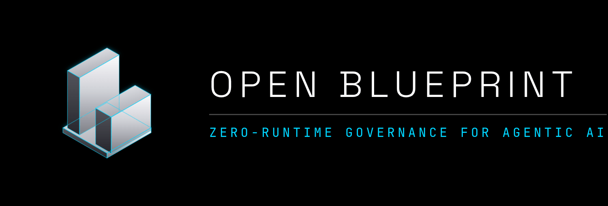

<p align="center">
  <picture>
    <source media="(prefers-color-scheme: dark)" srcset="icons/brand/brand-lockup-dark.png">
    <source media="(prefers-color-scheme: light)" srcset="icons/brand/brand-lockup-light.png">
    
  </picture>
</p>

<h1 align="center">open-blueprint (`bp`)</h1>

<p align="center">
  <a href="https://www.npmjs.com/package/@agentic/bp"></a>
  <a href="LICENSE"></a>
  <a href="https://github.com/0xkhdr/open-blueprint/actions"></a>
  <a href="vitest.config.ts"></a>
  <a href="https://bun.sh"></a>
</p>

**open-blueprint (`bp`)** is a development- and CI-time CLI that prepares repositories
for agentic AI coding tools (Claude Code, Cursor, Codex, Gemini CLI, and 27 others).
It detects your project's topology, scaffolds standardized governance files (rules,
skills, agents, hooks), validates them across six levels, detects drift, and translates
the whole structure between backends through a neutral intermediate representation.

`bp` adds **zero runtime overhead**: it generates the native config files your tools
already understand, then gets out of the way — you can uninstall it and the governance
keeps working.

Governance is **measured, not declared**: `bp report` evaluates every rule against the
repository and publishes per-rule, per-pack, per-framework compliance — including SARIF
output that annotates pull requests via GitHub code scanning. Rules that cannot be
machine-checked are reported as *manual*, never silently counted as passing.

```text
                  ┌──────────────────────────────┐
                  │            bp CLI            │
                  └──────────────┬───────────────┘
                                 │
          ┌──────────────────────┼───────────────────────┐
          ▼                      ▼                       ▼
  ┌──────────────┐        ┌──────────────┐        ┌──────────────┐
  │   DETECTOR   │        │  TEMPLATER   │        │  VALIDATOR   │
  │  (Repo MRI)  ├───────►│ (Handlebars) ├───────►│  (6 levels)  │
  └──────────────┘        └──────────────┘        └──────┬───────┘
                                                         ▼
                                                  ┌──────────────┐
                                                  │  TRANSLATOR  │
                                                  │(BlueprintIR) │
                                                  └──────────────┘
```

## Quick Start

```bash
# Scaffold governance for Claude Code (frameworks auto-detected)
npx @agentic/bp init claude

# Validate: structural, semantic, logical, enforcement, drift, governance
npx @agentic/bp verify

# Measure compliance and gate CI on hard violations
npx @agentic/bp report --sarif report.sarif --fail-on hard
```

Requires Node.js ≥ 20 or Bun ≥ 1.0. Full walkthrough (including Docker usage):
[Getting Started](docs/getting-started.md).

## Documentation

Full index: **[docs/README.md](docs/README.md)**. Highlights:

| | |
|---|---|
| [Getting Started](docs/getting-started.md) | Install, scaffold, and verify in five minutes |
| [Concepts & Architecture](docs/concepts.md) | The 5 governance layers, 4 engines, 6 validation levels |
| [CLI Reference](docs/commands.md) | Every command, subcommand, and flag |
| [Configuration](docs/configuration.md) | `.bp.json`, `~/.bp/config.json`, environment variables |
| [Supported Tools](docs/supported-tools.md) | All 31 backends: paths, syntax, limitations |
| [Governance Reporting](docs/governance-reporting.md) | `bp report`, SARIF PR annotations, measured coverage |
| [Rule Packs](docs/rule-packs.md) · [Skill Authoring](docs/skill-authoring.md) | Author and share governance content |
| [Plugin API](docs/plugin-api.md) | Custom validators via `@agentic/bp/plugin` |
| [Pack Distribution](docs/pack-distribution.md) | Signed artifacts, trust keyring, static-host registry |
| [Troubleshooting](docs/troubleshooting.md) | Exit codes 0–10 and diagnostics |
| [AGENTS.md](AGENTS.md) | Guide for AI agents and contributors working on this codebase |

## Supported Backends

`bp` supports **31 backends** — Claude Code, Cursor, OpenAI Codex CLI, GitHub Copilot,
Gemini CLI, Windsurf, Cline, Kiro, Roo Code, Amazon Q, OpenCode, Qwen, Kimi, Trae, and
more. See [docs/supported-tools.md](docs/supported-tools.md) for the full matrix with
paths, command syntax, and per-backend limitations.

```bash
bp init --tools claude,cursor,windsurf     # multiple backends at once
bp init --tools all                        # all 31
bp convert --from claude --to windsurf     # translate between any pair
bp doctor --all                            # diagnose every configured backend
```

## Ownership Tracking & Round-Trip

`bp` records the files it generates in `.bp/manifest.json`, so it can tell an
intentional developer edit from configuration rot — and adopt files you authored
yourself:

```bash
bp adopt --status         # classify files: managed | modified | missing | untracked
bp adopt                  # bring user-authored rules/skills under ownership tracking
bp adopt --wrap           # ...and wrap their bodies in bp:preserve markers
bp emit                   # serialize the parsed BlueprintIR back to disk (round-trip)
```

## Honest Limitations

This project values honest output over impressive output (see the
[production audit](docs/production-audit.md)):

- **Core adapters carry the fidelity guarantee.** `claude`, `cursor`, `codex`, and
  `generic` round-trip at ≥ 95 % (test-enforced). Most other backends inherit shared
  base adapters: functional, but without backend-specific round-trip tests.
- **Cost figures are configuration-driven.** `bp` does not meter live token usage;
  wire real numbers from your provider's billing into the blueprint's `cost` section.
- **No hosted registry.** Template/pack distribution works via npm search plus signed
  artifacts on any static host you control ([details](docs/pack-distribution.md)).
- **Rule enforcement is static analysis.** Rules that can't be expressed as a static
  check are reported as *manual* — a documented obligation, not a pass.

## License

MIT — see [LICENSE](LICENSE).
