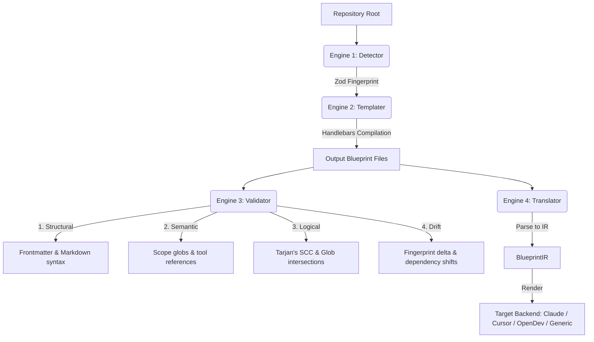

# 🏗️ System Architecture & Concepts
Permalink: System Architecture & Concepts

This document provides a deep dive into the underlying concepts, architectural layers, and system engines that power **open-blueprint (`bp`)**.

---

## 🗺️ Artifact Flow Diagram
Permalink: Artifact Flow Diagram

The lifecycle of repository configuration under `bp` follows a clean, single-direction pipeline that preserves custom developer inputs:

```
Repository ──► Detector ──► Fingerprint ──► Templater ──► Blueprint Files ──► Validator ──► Translator
   │              │              │               │                  │                │
   └──────────────┴──────────────┴───────────────┴──────────────────┴────────────────┘
                        bp:preserve blocks retain developer edits
```

---

## 🗂️ The 5 Blueprint Layers
Permalink: The 5 Blueprint Layers

`bp` structures repository governance into five discrete, logical layers:

| Layer | Name | Target File Pattern (Claude) | Core Purpose |
| :--- | :--- | :--- | :--- |
| **1** | **Spatial Anchor** | `CLAUDE.md` / `.claude/CLAUDE.md` | Contextualizes where the agent is in the project lifecycle, outlining commands and topology. |
| **2** | **Personas / Agents** | `.claude/agents/*.md` | Defines agent capabilities, permitted tools, and reasoning styles (e.g. Planner, Implementer, Reviewer). |
| **3** | **Rules** | `.claude/rules/*.md` | Establishes hard and soft constraints on the filesystem (e.g., security guidelines, styling patterns). |
| **4** | **Skills** | `.claude/skills/*.md` | Provides reusable step-by-step procedures to accomplish tasks (e.g. adding tests, refactoring async). |
| **5** | **Hooks** | `.claude/hooks/*` | Orchestrates lifecycle callback scripts run at tool boundaries (e.g., `pre_tool_use.js`). |

---

## ⚙️ The 4 Internal Engines
Permalink: The 4 Internal Engines

`bp` features a decoupled pipeline architecture consisting of four core engines:



---

### 1. Detector Engine
Permalink: Detector Engine

The **Detector** performs rapid, non-invasive static analysis of the repository. It makes **zero network calls, zero build-tool invocations, and runs zero shell commands**, completing in milliseconds.

* **Lockfile Parsing**: Detects package managers, linters, formatters, and bundlers via lockfile inspections (`package-lock.json`, `go.mod`, `Cargo.toml`, `poetry.lock`, `requirements.txt`).
* **Language & Framework Confidence Scoring**: Inspects directory topology and project files to compute primary languages and frameworks.
* **Output**: A Zod-validated `Fingerprint` object containing full system metadata:

```json
{
  "version": "1.0",
  "detected_at": "2026-05-28T02:34:11Z",
  "project": {
    "name": "my-express-service",
    "root": "/var/www/html/my-service",
    "type": "application",
    "git_workflow": "trunk-based"
  },
  "languages": [
    { "name": "typescript", "confidence": 1.0, "primary": true },
    { "name": "javascript", "confidence": 0.8, "primary": false }
  ],
  "frameworks": [
    { "name": "express", "confidence": 1.0 }
  ],
  "entry_points": [
    { "path": "src/index.ts", "type": "server" }
  ],
  "tooling": {
    "package_manager": "npm",
    "test_runner": "vitest",
    "test_command": "npm run test",
    "build_tool": "vite",
    "linter": "biome",
    "formatter": "biome",
    "ci_system": "github-actions"
  },
  "directory_topology": {
    "src_dirs": ["src"],
    "test_dirs": ["tests"],
    "config_dirs": ["."],
    "package_dirs": []
  },
  "security_signals": {
    "has_auth": true,
    "has_external_apis": false,
    "has_secrets_manager": true,
    "has_docker": true
  }
}
```

---

### 2. Templater Engine
Permalink: Templater Engine

The **Templater** maps the detected `Fingerprint` to template packs utilizing highly secure, logic-less **Handlebars** templates.

* **Template Fallback Chain**: 
  `Fingerprint ➔ [Language + Framework] ➔ Language Base ➔ Generic Fallback`
* **Block-Level Merging (Idempotency)**: To ensure developer modifications are preserved, `bp` parses files into generated blocks and preserve blocks:

```markdown
<!-- bp-generated:begin position -->
# Position: My Application
- Primary Language: TypeScript (Express)
- Entrypoint: src/index.ts
<!-- bp-generated:end position -->

<!-- bp:preserve -->
# Custom Team Conventions
- Always suffix controllers with 'Controller'.
- Internal billing microservices must log transaction UUIDs.
<!-- bp:end-preserve -->
```

On subsequent runs of `bp init`, the generated block is safely overwritten, while the `bp:preserve` blocks are retained exactly as-is.

---

### 3. Validator Engine
Permalink: Validator Engine

The **Validator** passes blueprints through a 4-layer validation pipeline. A failure in an early layer halts execution for that specific file but allows others to proceed.

```
[Blueprint Files] ──► Structural ──► Semantic ──► Logical ──► Drift ──► [Green CI / Clean Local]
```

1. **Structural Layer**: Validates YAML frontmatter formatting, file size thresholds, markdown structural hierarchy (unclosed code fences, broken header structures), and UTF-8 encoding.
2. **Semantic Layer**: Resolves rule scope globs against the actual filesystem (warning on zero-match scopes), verifies that `tools_required` exist in the target agent's allowlist, and guarantees that skills referenced by rules exist.
3. **Logical Layer**:
   * **Circular Skill Dependencies**: Performs a topological sort using **Tarjan's strongly connected components algorithm (`O(V+E)`)** to block circular skill imports.
   * **Rule Scope Overlap & Contradictions**: Evaluates scope overlaps. If two `hard` severity rules cover matching files (e.g. `src/services/**` vs `src/services/legacy/**`) and issue conflicting actions, a critical overlap error is thrown.
   * **Precedence Checking**: Validates that all rules are accounted for in the meta-rule precedence declarations.
4. **Drift Layer**: Compares current repository topology against `.bp-fingerprint.json` to detect unmapped dependencies, modified entry points, altered test commands, or untracked directories lacking rule coverage.

---

### 4. Translator Engine
Permalink: Translator Engine

The **Translator** converts blueprints between different agent targets by parsing raw documents into a unified, Zod-validated intermediate schema (`BlueprintIR`), and rendering the IR through target-specific adapters.

```
Source Files (.claude/) ──► IR Parser ──► BlueprintIR ──► IR Renderer ──► Target Files (.cursorrules)
```

Fidelity remains above **98%** in round-trip translations (e.g. `claude` ➔ `cursor` ➔ `claude`).
