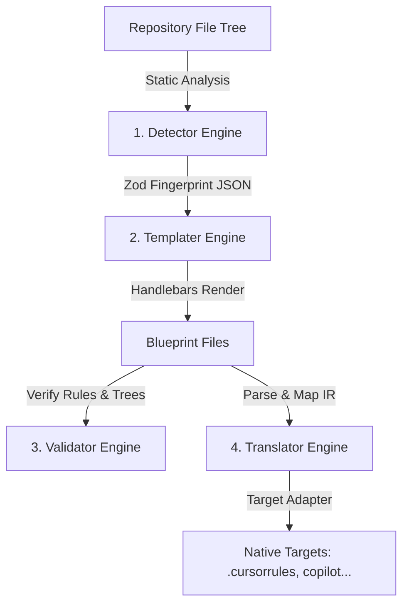

# open-blueprint (`bp`) — System Architecture Guide

This guide details the system architecture, core philosophy, and technical design of **open-blueprint (`bp`)**. It serves as the definitive reference for core developers, contributors, and systems architects.

---

## 1. Core Philosophy

`bp` is an agentic developer-governance utility. Unlike runtime orchestrators or middleware layers, `bp` follows the **Zero-Runtime-Overhead Contract**:

1. **Scaffolding-Only**: `bp` operates exclusively at development-time and CI-time. It constructs, verifies, and harmonizes configuration files natively consumed by agentic AI tools (e.g. Claude Code, Cursor, Copilot). Once the files are built, the agentic tool reads them directly.
2. **Zero Runtime Footprint**: No background processes run alongside the agentic loop. There are no additional runtime tokens consumed, no proxy delays, and no context-window overhead in production.
3. **Idempotency via Block-Level Merging**: Successive runs of `bp init` safely overwrite generated boilerplate while perfectly preserving custom developer annotations and rules using structural markdown demarcators.
4. **Fail-Loud Diagnostics**: Silent configuration ignores are the bane of AI interactions. `bp` enforces rigorous, multi-layered verification, outputting exact file-and-line indices, semantic failures, and actionable resolution paths.
5. **Progressive Disclosure**: Out-of-the-box, `bp init` automatically detects project structures with zero manual config. Advanced capabilities, such as multi-agent orchestration, compliance layers, and custom MCP bindings, unlock incrementally via `.bp.json` or project-level extending.

---

## 2. The 5 Blueprint Layers

`bp` structures repository governance into five discrete, logically isolated layers:

```
┌────────────────────────────────────────────────────────┐
│ Layer 1: Spatial Anchor (CLAUDE.md)                    │
├────────────────────────────────────────────────────────┤
│ Layer 2: Personas & Agents (.claude/agents/*.md)       │
├────────────────────────────────────────────────────────┤
│ Layer 3: Rules (.claude/rules/*.md)                    │
├────────────────────────────────────────────────────────┤
│ Layer 4: Skills (.claude/skills/*.md)                  │
├────────────────────────────────────────────────────────┤
│ Layer 5: Hooks (.claude/hooks/*)                       │
└────────────────────────────────────────────────────────┘
```

| Layer | Name | Claude File Pattern | Purpose |
| :--- | :--- | :--- | :--- |
| **Layer 1** | **Spatial Anchor** | `CLAUDE.md` / `.claude/CLAUDE.md` | Establishes where the agent is in the project lifecycle, listing active terminal commands, entry points, and directory layout. |
| **Layer 2** | **Personas / Agents** | `.claude/agents/*.md` | Configures model roles (e.g., Planner, Implementer, Auditor), details reasoning styles, and defines permitted tool-use allowlists. |
| **Layer 3** | **Rules** | `.claude/rules/*.md` | Imposes filesystem and code conventions. Standardizes styling, directory structural boundaries, and security constraints. Includes `hard` vs `soft` severities. |
| **Layer 4** | **Skills** | `.claude/skills/*.md` | Outlines reproducible procedures (e.g., "how to write a unit test", "how to build a schema"). Guides agents step-by-step through standard chores. |
| **Layer 5** | **Hooks** | `.claude/hooks/*` | Orchestrates lifecycle scripts executed at tool or command boundaries (e.g., executing `pre_tool_use.js` before agent tool invocation). |

---

## 3. The 4 Underlying Engines

`bp` is composed of four decoupled core engines coordinating via a unified pipeline:



---

### 3.1 The Detector Engine (`src/detector`)

The Detector performs static analysis of the repository. Under the **Zero-Overhead Contract**, the Detector executes **zero shell commands, zero network calls, and zero external build tools**. It relies purely on fast synchronous filesystem reads, concluding in milliseconds.

#### 1. Signal & Heuristic Scanning
- **Language Detection (`languages.ts`)**: Scans root file patterns and folder structures to compute confidence scores (0.0 to 1.0) for supported environments.
- **Framework Detection (`frameworks.ts`)**: Inspects dependency arrays within package locks or configuration roots (`package.json`, `Cargo.toml`, `go.mod`, etc.) to locate active library signals.
- **Tooling Detection (`tooling.ts`)**: Automatically identifies test runners (Jest, Vitest, Pytest), linters (Biome, ESLint), formatters, CI providers, and package managers.
- **Directory Topology Scans**: Categorizes directories into source (`src`, `lib`), testing (`tests`, `specs`), config, and sub-package directories.
- **Security Scan (`security.ts`)**: Scans for the existence of sensitive patterns like authentication modules, database adapters, secret managers, Docker files, and environment configurations.

#### 2. The Fingerprint Schema
The engine outputs a Zod-validated `Fingerprint` schema:

```typescript
export const FingerprintSchema = z.object({
  version: z.literal("1.0"),
  detected_at: z.string().datetime(),
  project: z.object({
    name: z.string(),
    root: z.string(),
    type: z.enum(["monorepo", "polyrepo", "library", "application", "service"]),
    git_workflow: z.enum(["github-flow", "trunk-based", "gitflow", "unknown"]),
  }),
  languages: z.array(z.object({
    name: z.string(),
    confidence: z.number().min(0).max(1),
    primary: z.boolean(),
  })),
  frameworks: z.array(z.object({
    name: z.string(),
    confidence: z.number().min(0).max(1),
  })),
  entry_points: z.array(z.object({
    path: z.string(),
    type: z.enum(["cli", "server", "library", "ui"]),
  })),
  tooling: z.object({
    package_manager: z.string().optional(),
    test_runner: z.string().optional(),
    test_command: z.string().optional(),
    build_tool: z.string().optional(),
    linter: z.string().optional(),
    formatter: z.string().optional(),
    ci_system: z.string().optional(),
  }),
  directory_topology: z.object({
    src_dirs: z.array(z.string()),
    test_dirs: z.array(z.string()),
    config_dirs: z.array(z.string()),
    package_dirs: z.array(z.string()),
  }),
  security_signals: z.object({
    has_auth: z.boolean(),
    has_external_apis: z.boolean(),
    has_secrets_manager: z.boolean(),
    has_docker: z.boolean(),
  }),
});
```

#### 3. Enrichment and Scoring
The raw `Fingerprint` is enriched to compute enterprise governance metrics:
- **Risk Scoring**: Calculates a cumulative integer score:
  - `has_external_apis` / `has_secrets_manager` / `has_auth`: **+2 points each**
  - `has_docker` / `project.type === "service"`: **+1 point each**
  - Security-sensitive frameworks (Payment gateways, OAuth): **+2 points**
  - Security libraries: **+1 point**
- **Risk Tier Classification**:
  - `Score >= 7`: **Critical**
  - `Score >= 5`: **High**
  - `Score >= 3`: **Medium**
  - `Score < 3`: **Low**
- **Suggested Approval Mode**:
  - `Critical` -> **read-only** (Strict read-only execution)
  - `High` -> **confirm** (Requires human-in-the-loop validation for all tools)
  - `Medium / Low` -> **auto** (Permissionless execution within sandbox constraints)
- **Token Estimation Formula**:
  Estimates monthly tokens consumed by agentic sweeps based on project surface size:
  $$\text{Tokens} = (\text{Base} [1000] + (\text{Source Dirs} \times 50 \, [\text{max } 5000]) + (\text{Frameworks} \times 100)) \times \text{Complexity Multiplier}$$
  *(where Monorepo Complexity = 1.5, else 1.0)*

---

### 3.2 The Templater Engine (`src/templater`)

The Templater engine receives the `Fingerprint` and maps it to target-specific blueprint structures.

```
                  ┌──────────────────────────────┐
                  │      Fingerprint Object      │
                  └──────────────┬───────────────┘
                                 │
                   [Selector Resolves Template]
                                 ▼
                  ┌──────────────────────────────┐
                  │    Target Template Folder    │
                  └──────────────┬───────────────┘
                                 │
                    [Registers Base Partials]
                                 ▼
                  ┌──────────────────────────────┐
                  │    Handlebars Compilation    │
                  └──────────────┬───────────────┘
                                 │
                   [Block-Level Idempotent Merge]
                                 ▼
                  ┌──────────────────────────────┐
                  │     Idempotent File Write    │
                  └──────────────────────────────┘
```

#### 1. Template Resolution Chain
1. Checks for user-defined local templates via `--template` override.
2. Checks `.bp.json` for base registry template inheritance (`extends`).
3. Resolves standard templates mapping to primary language + top framework (e.g. `typescript-nestjs`).
4. Falls back to base language configurations (`typescript-generic`).
5. Cascades to global framework-agnostic defaults (`generic-fallback`).

#### 2. Template Inheritance (`extends`)
When a repository is part of a large organization, the local blueprint can inherit from a centralized base template pack published to a shared template registry. The templater pulls the base registry template, runs compilation, and then superimposes local project-level overrides.

#### 3. Idempotent Block-Level Merging
Full file overwrites destroy developer customizations. To maintain idempotency, the templater divides target blueprints into marked segments:

- **Generated Blocks (`bp-generated`)**: Contain standard rules, spatial anchors, and commands. Safe to overwrite.
  ```markdown
  <!-- bp-generated:begin dependencies -->
  * Package Manager: npm
  * Build Tool: vite
  <!-- bp-generated:end dependencies -->
  ```
- **Preserve Blocks (`bp:preserve`)**: Safeguard developer-written constraints, custom scripts, or unique styles.
  ```markdown
  <!-- bp:preserve -->
  * Custom Convention: All database migrations must be audited by DB Secops.
  <!-- bp:end-preserve -->
  ```

During initialization (`bp init`), `merger.ts` parses the existing file, extracts the content inside `bp:preserve` blocks, performs the compilation of generated sections, and merges the custom preserve blocks back into the compiled text.

---

### 3.3 The Validator Engine (`src/validator`)

The Validator pipeline operates in five progressive stages. Each stage must pass for individual files to advance. Hard errors block pipeline progression.

```
             ┌────────────────────────────────────────┐
             │       Files Gathered via Glob          │
             └───────────────────┬────────────────────┘
                                 │
             ┌───────────────────▼────────────────────┐
             │ Layer 1: Structural (Frontmatter/UTF8) │
             └───────────────────┬────────────────────┘
                                 │
             ┌───────────────────▼────────────────────┐
             │ Layer 2: Semantic (FS Globs/Tools/Ref) │
             └───────────────────┬────────────────────┘
                                 │
             ┌───────────────────▼────────────────────┐
             │ Layer 3: Logical (Tarjan's SCC/Overlap)│
             └───────────────────┬────────────────────┘
                                 │
             ┌───────────────────▼────────────────────┐
             │ Layer 4: Drift (Cache Fingerprint Diff)│
             └───────────────────┬────────────────────┘
                                 │
             ┌───────────────────▼────────────────────┐
             │ Layer 5: Governance (Enterprise Layers)│
             └────────────────────────────────────────┘
```

#### 1. Structural Layer (`structural.ts`)
- Parsed concurrently in batches using unified/remark.
- Validates structural Markdown integrity (e.g. unclosed code fences, malformed headers).
- Decodes content to guarantee valid UTF-8 compliance and flags Byte Order Mark (BOM) anomalies.
- Enforces strict size thresholds (e.g., rules/skills must remain small to preserve model context).
- Parses and typechecks YAML frontmatter metadata using Zod schema structures.

#### 2. Semantic Layer (`semantic.ts`)
- Resolves rule scope globs against the real filesystem tree, raising warnings if a rule scope targets zero files (stale/broken globs).
- Validates that agents have proper `tools_required` configurations conforming to target allowlists.
- Verifies that rule files declaring skill requirements map to existing, valid skill blueprints.

#### 3. Logical Layer (`logical.ts`)
- **Circular Skill Dependency Checker**: Constructing skill blueprints with cyclic imports creates infinite execution loops for models. `bp` models skills as a directed graph $G = (V, E)$, running **Tarjan's Strongly Connected Components (SCC) algorithm in $O(V+E)$** time to catch cycles.
- **Rule Scope Intersection & Contradiction**: Identifies overlapping rule paths (e.g., `src/services/**` vs `src/services/billing/**`). If two hard rules cover matching files and direct conflicting outcomes (e.g., "Must use absolute paths" vs "Must use relative imports"), the validator flags a critical logical intersection error.
- **Precedence Verification**: Guarantees that conflicting rules are registered and resolved in the main governance precedence declaration.

#### 4. Drift Layer (`drift.ts`)
- Compares the active filesystem structure against the `.bp-fingerprint.json` cache.
- Detects changed entry points, altered testing commands, newly created directories that lack rule coverage (`UNCOVERED_DIRECTORY`), or newly introduced third-party package dependencies that change the project's configuration topology.

#### 5. Governance Layer (`layers.ts`, `rbac.ts`)
Validates high-level enterprise policies:
- **Settings Layer**: Validates temperature configurations, budget parameters, safety profiles, and cost controls.
- **Commands Layer**: Confirms alias mappings and approval permissions.
- **MCP Layer**: Validates model context protocol configurations, endpoints, and tool risks.
- **RBAC & Identity Layer**: Inspects roles, permission scopes, and verifies that agent actions conform to owner access rights.
- **Compliance Layer**: Checks schema mapping against regulatory standards (EU AI Act, ISO 42001, NIST AI RMF).
- **Risk & Orchestration**: Verifies escalation paths and multi-agent sequences.

---

### 3.4 The Translator Engine (`src/translator`)

The Translator facilitates multi-platform compliance. It compiled vendor-specific configuration formats into a centralized Intermediate Representation (`BlueprintIR`) and exports it into target formats.

```
  Vendor Blueprint              Intermediate Representation               Target Blueprint
┌─────────────────┐             ┌─────────────────────────┐             ┌──────────────────┐
│   CLAUDE.md     ├────────────►│                         ├────────────►│  .cursorrules    │
│  .claude/rules/ │  (Parse)    │      BlueprintIR        │  (Render)   │  .cursor/rules/  │
└─────────────────┘             │  (Zod Schema v2.0)      │             └──────────────────┘
                                │                         │
                                └─────────────────────────┘
```

#### 1. The BlueprintIR Schema
The IR acts as the tool-agnostic semantic layer. It maps anchors, personas, hard/soft constraints, step-by-step procedures, and lifecycle hooks into a strict object representation. This ensures that the governance meaning is preserved perfectly, regardless of syntax differences.

#### 2. Adapter Architecture
The engine includes specialized adapters:
- **ClaudeAdapter**: Manages split markdown folder architectures (`.claude/rules`, `.claude/skills`).
- **CursorAdapter**: Packs and flattens files into `.cursorrules` or `.cursor/rules/` JSON formats.
- **CopilotAdapter**: Compiles rules into Copilot-friendly formats.
- **GeminiAdapter**: Constructs context profiles for Gemini integrations.
- **Antigravity / Kiro / Codex / PI Adapters**: Direct compilers for advanced agent configurations.
- **GenericAdapter**: General-purpose YAML/JSON representation fallback.

---

## 4. Systems Data Flow & Caching

To guarantee sub-second execution in CI environments, `bp` implements a file-level modification cache (`.bp-cache.json`):

1. **Compilation Phase**: Before running validators, the engine checks for cache matching.
2. **File Checksums**: Compares file modification times (`mtimeMs`).
3. **Partial Verification**: If a blueprint file's checksum is identical to the cached entry, its structural and semantic validation results are loaded directly from the cache, skipping re-parsing.
4. **Logical/Drift Layers**: Global validations (like circular dependencies and filesystem drift checks) bypass the cache and run in real-time on each execution to guarantee correctness across the whole tree.

---

## 5. Security & Verification Design

`bp` incorporates cryptographic security layers to govern third-party templates:

- **RSA Keypairs**: Employs standard 2048-bit RSA key pairs (`spki`/`pkcs8` PEM format).
- **SHA256 Signatures**: Packaged templates are archived, hashed, and signed using a developer's private key.
- **Secure Unpacking**: The Registry client validates archive integrity against the author's public key (or default `@bp-templates` official keys) before writing files to the disk, blocking supply-chain template manipulation.
