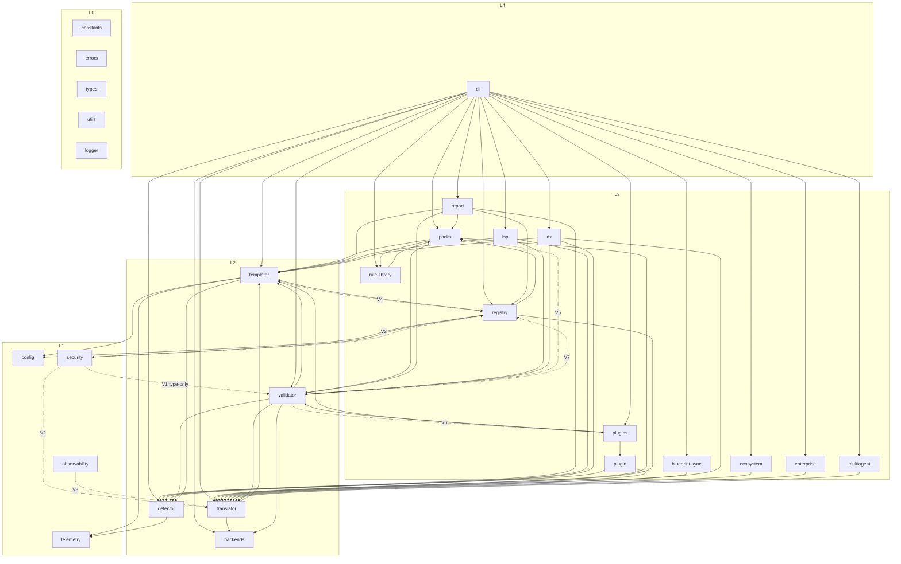

# Stage 1 — Module Dependency Graph

Generated 2026-06-12 from `madge --extensions ts --ts-config tsconfig.json --json src/`
(201 files processed). Edge weight = number of file-level import edges between the two modules.

## Layering model (from spec.md §4.1)

- **L0 foundations**: `constants.ts`, `errors.ts`, `types/`, `utils/`, `logger.ts`
- **L1 infrastructure**: `config/`, `observability/`, `telemetry/`, `security/`
- **L2 engines**: `detector/`, `templater/`, `validator/`, `translator/`, `backends/`
- **L3 services**: `packs/`, `registry/`, `report/`, `plugins/`, `plugin/`, `lsp/`,
  `blueprint-sync/`, `rule-library/`, `dx/`, `ecosystem/`, `enterprise/`, `multiagent/`
- **L4 presentation**: `cli/`

## Edge table

| From | To | Weight | Direction | Verdict |
|---|---|---|---|---|
| backends (L2) | logger (L0) | 1 | down | ok |
| blueprint-sync (L3) | translator (L2) | 3 | down | ok |
| cli (L4) | 24 modules | 187 total | down | ok (presentation may import anything) |
| detector (L2) | constants, logger, utils (L0) | 4 | down | ok |
| detector (L2) | telemetry (L1) | 1 | down | ok |
| dx (L3) | detector, templater, translator, validator (L2), logger (L0) | 8 | down | ok |
| ecosystem (L3) | translator (L2), utils (L0) | 4 | down | ok |
| enterprise (L3) | translator (L2) | 2 | down | ok |
| lsp (L3) | detector, templater, validator (L2) | 6 | down | ok |
| multiagent (L3) | translator (L2) | 1 | down | ok |
| **observability (L1)** | **translator (L2)** | **1** | **up** | **violation — should-fix** |
| packs (L3) | errors (L0), templater/translator/validator (L2) | 12 | down | ok |
| packs (L3) | rule-library (L3) | 1 | lateral | ok |
| plugin (L3) | detector, translator (L2) | 2 | down | ok |
| plugins (L3) | errors (L0), templater/validator (L2) | 5 | down | ok |
| plugins (L3) | plugin (L3) | 2 | lateral | ok |
| registry (L3) | config (L1), constants/errors/logger/utils (L0) | 12 | down | ok |
| registry (L3) | security (L1), templater/translator (L2) | 5 | down | ok |
| registry (L3) | packs (L3) | 4 | lateral | ok |
| report (L3) | detector/templater/validator (L2), utils (L0) | 8 | down | ok |
| report (L3) | packs, registry (L3) | 2 | lateral | ok |
| rule-library (L3) | packs (L3) | 4 | lateral | ok (with packs→rule-library forms a **module-level cycle**) |
| rule-library (L3) | translator (L2) | 1 | down | ok |
| **security (L1)** | **validator (L2)** | **1** | **up** | **violation — type-only (`ValidationError`); should-fix** |
| **security (L1)** | **translator (L2)** | **1** | **up** | **violation — should-fix** |
| **security (L1)** | **registry (L3)** | **1** | **up (2 layers)** | **violation — should-fix** |
| security (L1) | logger (L0) | 1 | down | ok |
| templater (L2) | config (L1), detector (L2), logger/utils (L0), telemetry (L1) | 10 | down/lateral | ok |
| **templater (L2)** | **registry (L3)** | **1** | **up** | **violation — should-fix** |
| **templater (L2)** | **security (L1)** | 1 | down | ok |
| translator (L2) | backends (L2), templater (L2), validator (L2) | 30 | lateral | ok (heavy backends coupling expected — adapter pattern) |
| utils (L0) | errors (L0) | 3 | lateral | ok |
| validator (L2) | backends/detector/templater/translator (L2) | 28 | lateral | high coupling — `validator → translator` weight 17, review cohesion in Stage 2 |
| validator (L2) | config (L1), security (L1), telemetry (L1), constants/logger/utils (L0) | 14 | down | ok |
| **validator (L2)** | **packs (L3)** | **2** | **up** | **violation — should-fix** |
| **validator (L2)** | **plugins (L3)** | **2** | **up** | **violation — should-fix** |
| **validator (L2)** | **registry (L3)** | **3** | **up** | **violation — should-fix** |

## Upward-dependency violations (summary for Stage 2)

| # | Edge | Severity | Proposed resolution |
|---|---|---|---|
| V1 | `security → validator` (type `ValidationError`) | should-fix | move `ValidationError` to `types/` or a shared `validation-types` module |
| V2 | `security → translator` | should-fix | extract the consumed interface into L0/L1 shared types |
| V3 | `security → registry` | should-fix | dependency inversion: registry passes what security needs as a parameter |
| V4 | `templater → registry` | should-fix | invert: cli/orchestrator wires registry data into templater |
| V5 | `validator → packs` (2) | should-fix | pack-integrity checks should receive pack data via interface, not import packs |
| V6 | `validator → plugins` (2) | should-fix | plugin validators should be injected by the orchestrator (cli), not pulled by validator |
| V7 | `validator → registry` (3) | should-fix | same inversion as V5 |
| V8 | `observability → translator` | should-fix | extract consumed types |
| V9 | `packs ↔ rule-library` module-level cycle | should-fix | `packs/store.ts` imports `BUILT_IN_PACKS` from rule-library while rule-library imports packs; move `BUILT_IN_PACKS` data or invert |

No `blocker`-severity violation found: none of the upward edges creates a runtime
initialization hazard today (verified file-level cycles separately — see
`findings.md` §1). They are architecture-erosion debt for Stage 2.

## Mermaid diagram (module level, violations dashed)

